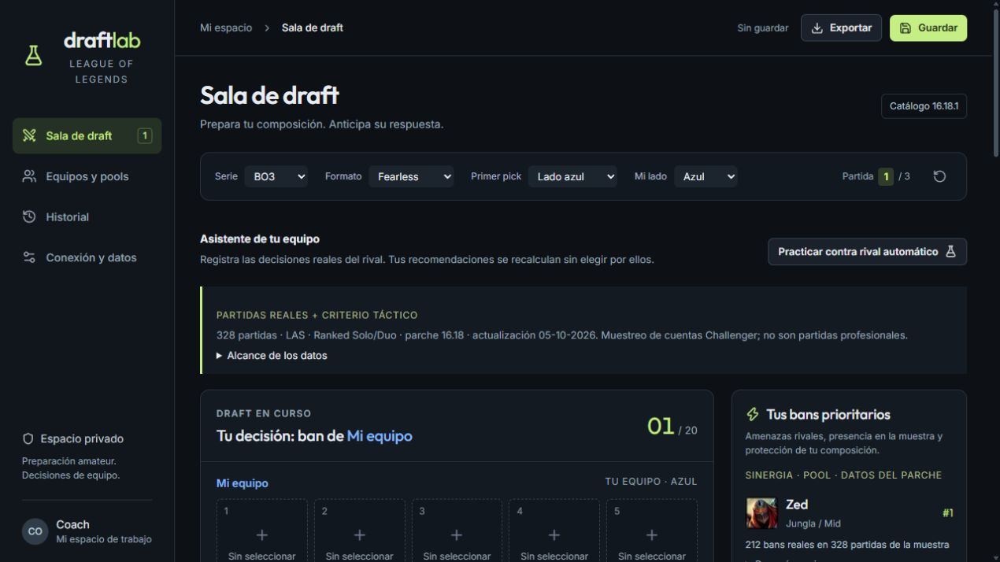

# Draftlab — preparación de drafts

Proyecto personal de **Ignacio Garrido**, Ingeniero en Informática titulado. Desarrollo propio de la aplicación; librerías, plantillas, datos e imágenes de terceros conservan su autoría.

React/TypeScript, vinext, Cloudflare D1 y colector Node/SQLite. Tablero de 20 decisiones, pools por rol, BO1/3/5, Fearless, undo/redo, escenarios, importación/exportación validada y guardado privado con control de revisión.



## Ejecutar localmente sin Riot
Node 22.18+:
```powershell
npm run install:ci
npm run build
node --import ./scripts/sites-env.mjs ./node_modules/wrangler/bin/wrangler.js d1 execute DB --local --config dist/server/wrangler.json --persist-to .wrangler/state --file drizzle/0000_melodic_doctor_doom.sql
npm run dev -- --port 5173
```
Abre la dirección que anuncie el servidor, normalmente `http://localhost:5173`. El plugin vendorizado permite una identidad de desarrollo solo desde loopback; no sirve como autenticación pública. Configuración D1 incluida con un ID ficticio, sin ID de proyecto remoto.

## Verificación
```powershell
node scripts/check.mjs
npx tsc --noEmit
npm run build
```
Verificados motor, validaciones, tipos, build y apertura de la sala tras aplicar la migración local. La entrega conserva 328 partidas reducidas a ID, fecha, equipos, picks, bans y resultado; no incluye PUUID, Riot ID ni cuentas del colector. Catálogo 16.18.1 y snapshot del parche 16.18. Ver metadatos en `public/data/meta.json`.

## Datos y límites
Fuente original Riot Match-V5; muestra de conveniencia de Solo/Duo LAS descubierta desde cuentas Challenger, sin verificar el nivel de todos los participantes. No son partidas profesionales. Las asociaciones se regularizan y exigen muestras mínimas; no son causales ni probabilidades calibradas. El historial de prácticas nunca se utiliza como evidencia estadística. Las estadísticas se desactivan con parches distintos.

## Actualizador opcional
Configura `RIOT_API_KEY` en un `.env.local` ignorado. `node scripts/collect-meta.mjs --status` consulta el actualizador; el panel documentado en scripts usa localhost:5180. La entrega no instala inicio automático ni activa rondas periódicas. La lógica de acumulación y límites se conserva; las llamadas reales a Riot y los checks HTTP del actualizador no se ejecutaron aquí.

English: an explainable draft planner with validated scenarios, patch isolation and private D1 persistence. Recommendations are heuristics, not validated match predictions.
